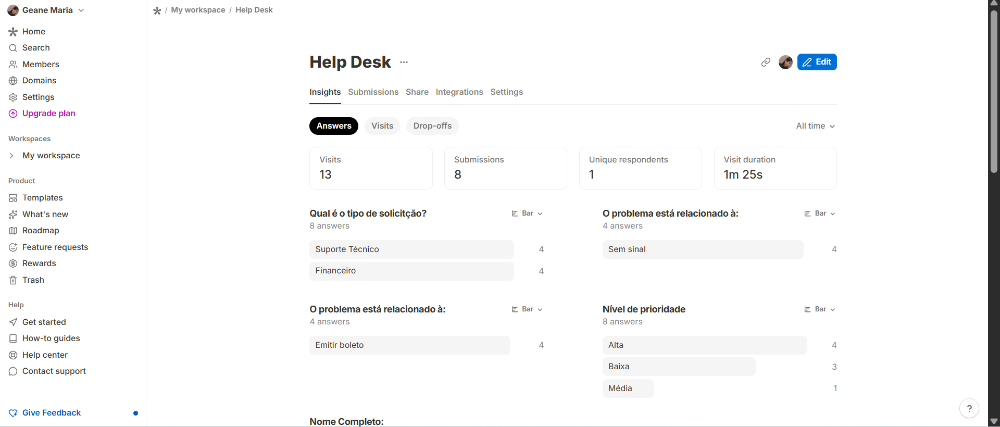
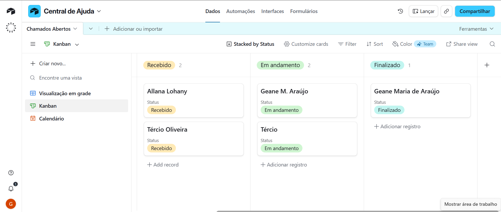

# Automação de Help Desk (No-Code)

Projeto de automação de fluxo de dados de ponta a ponta, conectando ferramentas para otimizar a gestão de chamados.

## 🛠 Ferramentas Utilizadas
- **Tally:** Para a criação do formulário de coleta de dados.
- **Activepieces:** Para orquestração da automação (no-code).
- **Airtable:** Para armazenamento e gestão dos dados em formato Kanban.
- **Gmail:** Para envio automático de notificações.

## 📊 Fluxo de Trabalho

## 📋 Organização e Gestão (Kanban)
Para facilitar a visualização do status de cada chamado, a base de dados no **Airtable** foi estruturada em um formato **Kanban**. 

- **Por que Kanban?** Esta metodologia permite acompanhar de forma visual o ciclo de vida de cada solicitação, desde a entrada (Abertura) até a conclusão, garantindo que nenhum chamado fique pendente sem o devido acompanhamento.
- **Estrutura:** O quadro permite filtrar rapidamente chamados por prioridade e responsável, otimizando o tempo de resposta e a gestão da equipe.

## 🚀 Objetivo
O objetivo deste projeto foi eliminar processos manuais no atendimento, garantindo que todo novo chamado seja automaticamente registrado e organizado sem a necessidade de uma linha de código.# automacao-helpdesk-nocode
